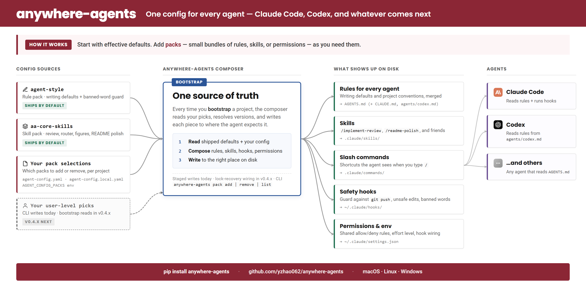
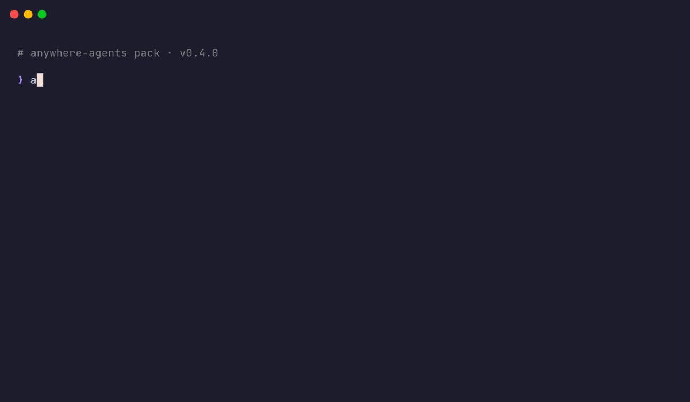

# anywhere-agents

**One config for every agent — Claude Code, Codex, and whatever comes next.**

<p align="center">
  
</p>

Start with effective defaults. Add **packs**, small bundles of rules, skills, or permissions, as you need them. One `AGENTS.md` drives every agent in every repo on every machine.

This site is the motivated-reader reference. For the scenario-first quick start, see the [README on GitHub](https://github.com/yzhao062/anywhere-agents).

## Why You'd Use This

Four problems this fixes:

- **You use more than one agent.** Claude Code at work, Codex on personal projects, Cursor on the side. One `AGENTS.md` drives all three.
- **You work across many repos.** Every new project repeats the same setup ritual. `bootstrap` pulls shared defaults and layers repo-local overrides on top.
- **You want a review loop before you push.** `/implement-review` hands your staged diff to a second reviewer, converges on feedback, and revises. Present the first time you `bootstrap`.
- **You want your agents to follow writing conventions automatically.** The default `agent-style` rule pack bans ~45 AI-tell words and formatting patterns; a PreToolUse guard denies any `.md` / `.tex` / `.rst` write that contains one.

Private-source packs are the v0.5.0 milestone: your own skills or team conventions shipped as first-class packs, with version locks and authentication for fetches against private repos. Today you can fork and extend packs manually; private-source authoring ships next.

## How It Works

A **pack** is a small bundle (a rule set, a skill, or a permission policy) that the composer deploys to wherever it needs to land: `AGENTS.md`, `.claude/skills/`, `.claude/commands/`, `~/.claude/hooks/`, or `~/.claude/settings.json`.

In v0.4.0, `bootstrap` installs the shipped defaults (`agent-style`, `aa-core-skills`) and any project-level selections from `agent-config.yaml` or `agent-config.local.yaml` when those files use the legacy `rule_packs:` key. It also accepts `AGENT_CONFIG_PACKS` as a transient name list.

The `anywhere-agents pack add | remove | list` CLI writes `packs:` to user-level config today; `bootstrap` starts consuming that user-level file, and the project-level `packs:` key, in v0.4.x. Private-source packs land in v0.5.0.

`bootstrap` is the sync step. Re-run it on any machine or repo, and `bootstrap` reproduces the shipped defaults plus the bootstrap-active project-level selections.

## Quick Install

=== "PyPI"

    ```bash
    pipx run anywhere-agents
    ```

=== "npm"

    ```bash
    npx anywhere-agents
    ```

=== "Raw shell (macOS / Linux)"

    ```bash
    mkdir -p .agent-config
    curl -sfL https://raw.githubusercontent.com/yzhao062/anywhere-agents/main/bootstrap/bootstrap.sh -o .agent-config/bootstrap.sh
    bash .agent-config/bootstrap.sh
    ```

=== "Raw shell (Windows)"

    ```powershell
    New-Item -ItemType Directory -Force -Path .agent-config | Out-Null
    Invoke-WebRequest -UseBasicParsing -Uri https://raw.githubusercontent.com/yzhao062/anywhere-agents/main/bootstrap/bootstrap.ps1 -OutFile .agent-config/bootstrap.ps1
    & .\.agent-config\bootstrap.ps1
    ```

Run the command once in the project root. Next time you open Claude Code or Codex there, the agent reads `AGENTS.md` automatically and inherits every default.

For more, see [Install](install.md).

## Pack Management CLI



```bash
anywhere-agents pack list
anywhere-agents pack add aa-core-skills --ref v0.4.0
anywhere-agents pack remove aa-core-skills
```

**v0.4.0 boundary.** For pack selections that must affect `bootstrap` today, use the legacy `rule_packs:` key in `agent-config.yaml` or `agent-config.local.yaml`, or pass names through `AGENT_CONFIG_PACKS`. The `anywhere-agents pack` CLI writes user-level `packs:` config now; bootstrap starts reading that user-level file and the project-level `packs:` key in v0.4.x.

**Authoring your own pack.** [`yzhao062/agent-pack`](https://github.com/yzhao062/agent-pack) is a public reference repo that declares three packs (two passive, one active) using the v2 manifest schema. Fork it as a starting point.

## What's Next

`v0.4.0` ships the pack runtime (state files, cross-platform locks, recoverable transactions) and the pack CLI. `v0.4.x` wires the composer to acquire those locks and to reconcile installed packs against the manifest on every session start. `v0.5.0` adds private-source packs: fetch packs from private repos with the standard Git authentication you already have configured (SSH key, `gh auth login`, or `GITHUB_TOKEN`). Shipped-status details live in the [changelog](changelog.md).

## What This Site Covers

- **[Install](install.md)** — PyPI, npm, raw shell. Prerequisites and troubleshooting.
- **[Rule packs](rule-pack-composition.md)** — the always-on instruction layer. Covers the default `agent-style` writing pack, opt-out, pin-a-version, and how to register a new pack.
- **[Skills](skills/index.md)** — deep documentation for the four shipped skills: `implement-review`, `my-router`, `ci-mockup-figure`, `readme-polish`.
- **[AGENTS.md reference](agents-md.md)** — section-by-section tour of the shared configuration.
- **[FAQ](faq.md)** — common questions and troubleshooting.
- **[Changelog](changelog.md)** — what has shipped and when.

## Who Maintains This

Maintained by [Yue Zhao](https://yzhao062.github.io) — USC Computer Science faculty and author of [PyOD](https://github.com/yzhao062/pyod) (9.8k★, 38M+ downloads, ~12k research citations). This is the sanitized public release of the agent config used daily since early 2026 across research, paper writing, and dev work on macOS, Windows, and Linux.

## License

[Apache 2.0](https://github.com/yzhao062/anywhere-agents/blob/main/LICENSE).
