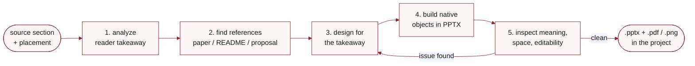

# editable-figure

Design a paper, proposal, or README figure and deliver it as a PowerPoint file whose text, shapes, and connectors the author can still edit. Covers source analysis, reference search for the document type, layout for one takeaway, native object construction, and inspection at the real publication width. Complements `ci-mockup-figure`, which produces HTML-captured and code-native figures instead.

!!! warning "Completing a build needs desktop PowerPoint"

    A PPTX library can write native objects on a headless machine, so authoring itself is not the constraint. Validation is: nothing on a Linux server, container, or CI job can confirm the file opens, renders, and edits as intended, which is the check that separates a real editable figure from a flattened image. That check needs desktop PowerPoint, so Windows or macOS. `scripts/render_powerpoint.ps1` narrows further, using Windows COM automation with no macOS equivalent. Assessment and prompt-only requests are unaffected. When the deliverable can be an image, [`ci-mockup-figure`](ci-mockup-figure.md) covers a headless machine.

The three inspection checks are separate on purpose. A figure can render correctly and still overstate a claim. It can also look right in a preview while its text is a flattened image rather than an editable object.


