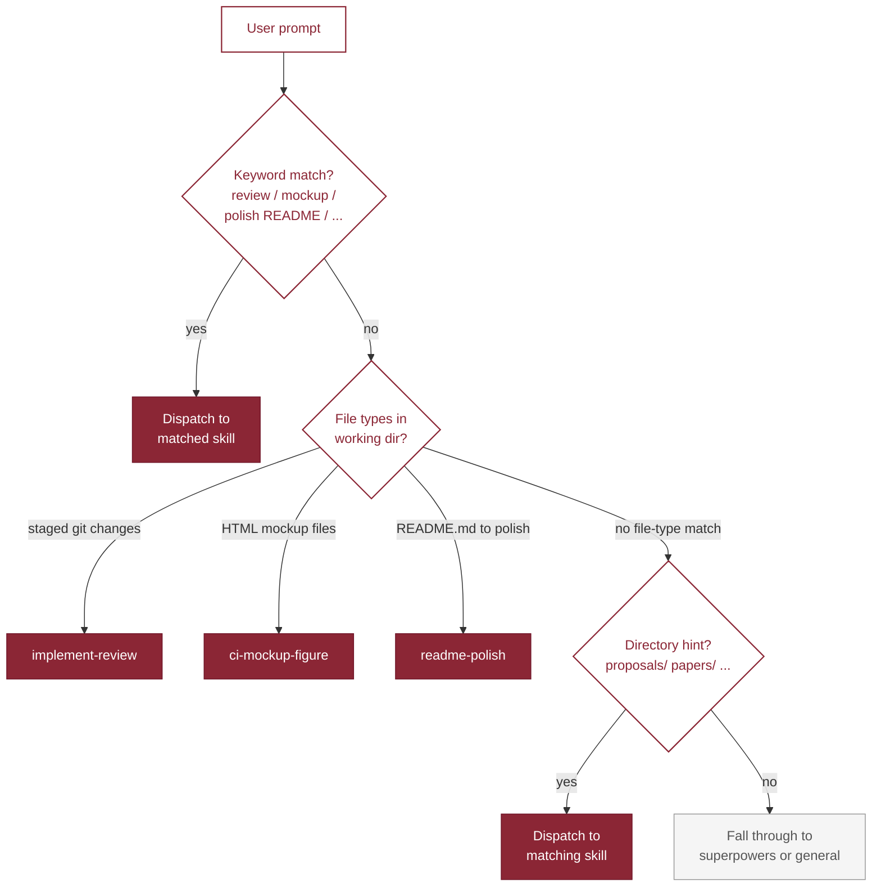

# my-router

Context-aware router that detects work type (code, paper, proposal, figure, README polish) and dispatches to the right domain skill. Reads prompt keywords, file types, and directory hints. Designed as a pattern you extend with rules for your own skills in a fork.



---

The full routing table — shipped skills, keyword triggers, file-type fallbacks, and directory hints — lives on a dedicated page: [Routing table](references/routing-table.md).
